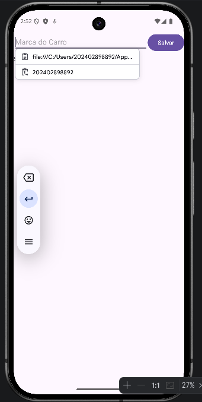
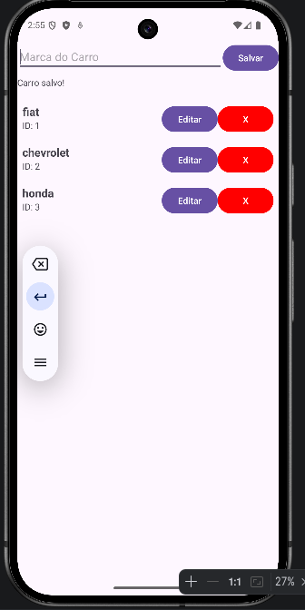
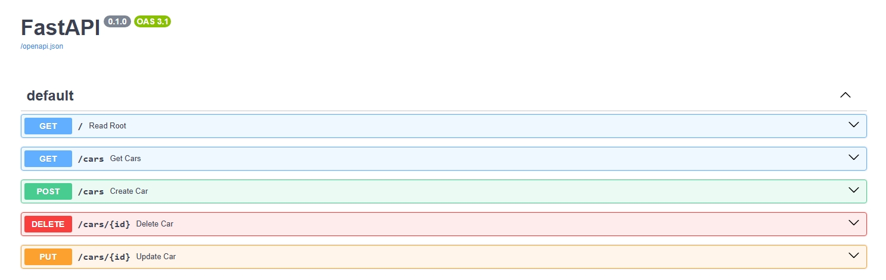

# app-apicrud
*   **Swagger UI (Documentação):** [http://127.0.0.1:8000/docs#/](http://127.0.0.1:8000/docs#/)
*   **Endpoint de Carros:** [http://127.0.0.1:8000/cars](http://127.0.0.1:8000/cars)

  
  
  
  

